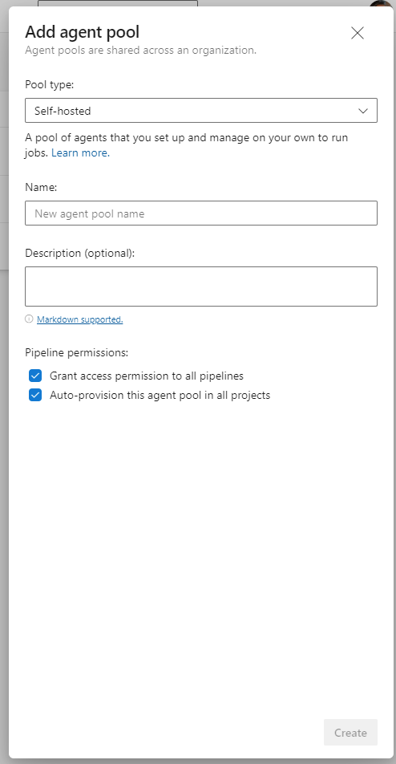
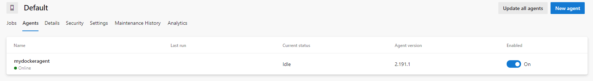

Azure DevOps provides basically two types of agents: **Microsoft-Hosted agents** and **Self-Hosted agents**.
## Microsoft-Hosted agents
The former are agents completely managed by Microsoft in the cloud, can be based on **Windows, Ubuntu or macOS**. For each OS, a set of software in included in the VM image used to spin up a new VM when a new job need to be executed (https://docs.microsoft.com/en-us/azure/devops/pipelines/agents/hosted?view=azure-devops&tabs=yaml#software).

The main advantage in using Microsoft-Hosted agents is that most of the time provide everything you need to build and deploy your solution without the need to set up, configure and maintain the OS and software packages required. 

The drawbacks are that you don't have control on the CPU and memory provided with the VM and you cannot have access to internal networks (everything need to be exposed on Internet). 

More details on capabilities and limitations of Microsoft-Hosted agents are [here](https://docs.microsoft.com/en-us/azure/devops/pipelines/agents/hosted?view=azure-devops&tabs=yaml#capabilities-and-limitations).

## Self-Hosted agents
Self-Hosted agents are basically agents that runs wherever you need. You have to take care about everything: the installation, set up and updates of the OS, all software packages required by your pipelines to build and deploy your solutions, the network configurations to reach the code repository, the Azure resources and, why not, the VMs where you will deploy software components. Also, for Self-Hosted agents, the supported operative systems are Windows, Ubuntu and macOS.

## Requirements
In the last project I have worked on, we had the need to deploy many Self-Hosted agents and, because the solution was based on .NET Framework 4.8, we had to use Windows based agents. 

So, considering that we had to prepare 4 different environments (Development, Quality, Performance and Production), and we decided to install two agents for each environment, we started analyzing the possibility to prepare a Windows based Docker image for this purpose.

## Prepare your Dockerfile
The first step to take is to prepare the Dockerfile needed to create the image.

```dockerfile
# escape=`

# Use the latest Windows Server Core image with .NET Framework 4.8.
FROM mcr.microsoft.com/dotnet/framework/sdk:4.8-windowsservercore-ltsc2019

# Restore the default Windows shell for correct batch processing.
SHELL ["cmd", "/S", "/C"]

# Download the Build Tools bootstrapper.
ADD https://aka.ms/vs/16/release/vs_buildtools.exe C:\TEMP\vs_buildtools.exe

# Install Build Tools with the workloads you need, excluding workloads and components with known issues.
# More details here: https://docs.microsoft.com/en-us/visualstudio/install/workload-component-id-vs-build-tools
RUN C:\TEMP\vs_buildtools.exe --quiet --wait --norestart --nocache --includeRecommended `
    --installPath C:\BuildTools `
    --add Microsoft.VisualStudio.Workload.AzureBuildTools `
    --add Microsoft.VisualStudio.Workload.OfficeBuildTools `
    --add Microsoft.VisualStudio.Workload.MSBuildTools `
    --add Microsoft.VisualStudio.Workload.NetCoreBuildTools `
    --add Microsoft.Net.Core.Component.SDK.2.1 `
    --remove Microsoft.VisualStudio.Component.Windows10SDK.10240 `
    --remove Microsoft.VisualStudio.Component.Windows10SDK.10586 `
    --remove Microsoft.VisualStudio.Component.Windows10SDK.14393 `
    --remove Microsoft.VisualStudio.Component.Windows81SDK `
 || IF "%ERRORLEVEL%"=="3010" EXIT 0

WORKDIR /azp
COPY start.ps1 .

# Define the entry point for the docker container.
# This entry point starts the developer command prompt and launches the PowerShell shell.
ENTRYPOINT ["C:\\BuildTools\\Common7\\Tools\\VsDevCmd.bat", "&&","powershell.exe", ".\\start.ps1"]
```
As you can see, we use as base image a **Windows Server Core image with .NET Framework 4.8** already installed. When we download the Visual Studio Build Tools and run the installation in quiet mode (an unattended mode that doesn't require user interaction).
Is very important to analyze the Visual Studio Build Tools setup arguments. As you can see we use the **--add** parameter to define all the workloads we need to install. A workload is a set of features and applications installed, and you can find the list of workloads and the features included in each workload [here](https://docs.microsoft.com/en-us/visualstudio/install/workload-component-id-vs-build-tools).

Obviously you can adapt this part with the workloads you need. In our case we had to add a lot of workloads because of the dependencies required by our solution to build correctly.

After the installation, the Dockerfile copies a PowerShell script called **start.ps1** in the azp folder and executes it. The script is the following:
```ps1
if (-not (Test-Path Env:AZP_URL)) {
    Write-Error "error: missing AZP_URL environment variable"
    exit 1
  }
  
  if (-not (Test-Path Env:AZP_TOKEN_FILE)) {
    if (-not (Test-Path Env:AZP_TOKEN)) {
      Write-Error "error: missing AZP_TOKEN environment variable"
      exit 1
    }
  
    $Env:AZP_TOKEN_FILE = "\azp\.token"
    $Env:AZP_TOKEN | Out-File -FilePath $Env:AZP_TOKEN_FILE
  }
  
  Remove-Item Env:AZP_TOKEN
  
  if ((Test-Path Env:AZP_WORK) -and -not (Test-Path $Env:AZP_WORK)) {
    New-Item $Env:AZP_WORK -ItemType directory | Out-Null
  }
  
  New-Item "\azp\agent" -ItemType directory | Out-Null
  
  # Let the agent ignore the token env variables
  $Env:VSO_AGENT_IGNORE = "AZP_TOKEN,AZP_TOKEN_FILE"
  
  Set-Location agent
  
  Write-Host "1. Determining matching Azure Pipelines agent..." -ForegroundColor Cyan
  
  $base64AuthInfo = [Convert]::ToBase64String([Text.Encoding]::ASCII.GetBytes(":$(Get-Content ${Env:AZP_TOKEN_FILE})"))
  $package = Invoke-RestMethod -Headers @{Authorization=("Basic $base64AuthInfo")} "$(${Env:AZP_URL})/_apis/distributedtask/packages/agent?platform=win-x64&`$top=1"
  $packageUrl = $package[0].Value.downloadUrl
  
  Write-Host $packageUrl
  
  Write-Host "2. Downloading and installing Azure Pipelines agent..." -ForegroundColor Cyan
  
  $wc = New-Object System.Net.WebClient
  $wc.DownloadFile($packageUrl, "$(Get-Location)\agent.zip")
  
  Expand-Archive -Path "agent.zip" -DestinationPath "\azp\agent"
  
  try
  {
    Write-Host "3. Configuring Azure Pipelines agent..." -ForegroundColor Cyan
  
    .\config.cmd --unattended `
      --agent "$(if (Test-Path Env:AZP_AGENT_NAME) { ${Env:AZP_AGENT_NAME} } else { ${Env:computername} })" `
      --url "$(${Env:AZP_URL})" `
      --auth PAT `
      --token "$(Get-Content ${Env:AZP_TOKEN_FILE})" `
      --pool "$(if (Test-Path Env:AZP_POOL) { ${Env:AZP_POOL} } else { 'Default' })" `
      --work "$(if (Test-Path Env:AZP_WORK) { ${Env:AZP_WORK} } else { '_work' })" `
      --replace
  
    Write-Host "4. Running Azure Pipelines agent..." -ForegroundColor Cyan
  
    .\run.cmd
  }
  finally
  {
    Write-Host "Cleanup. Removing Azure Pipelines agent..." -ForegroundColor Cyan
  
    .\config.cmd remove --unattended `
      --auth PAT `
      --token "$(Get-Content ${Env:AZP_TOKEN_FILE})"
  }
```

The script logic can be summarized as follows:
- Downloads and installs the latest version of the Agent for Windows x64 platform
- Configures the agent (this will register the agent on the Agent Pool you specify)
- Executes the agent
If an error occurs (finally block), the remove procedure is invoked in order to deregister the agent from the Agent Pool.

Taking a look at the script you can see that some environmental variables are used to configure the agent installation. The following variables need to be configured:
- **AZP_URL**: for example "https://dev.azure.com/yourorganization"
- **AZP_TOKEN**: a valid Personal Access Token (see https://docs.microsoft.com/en-us/azure/devops/organizations/accounts/use-personal-access-tokens-to-authenticate?view=azure-devops&tabs=preview-page)
- **AZP_POOL**: the Azure DevOps Agent Pool name (
- **AZP_AGENT_NAME**: the agent name

You can manage Azure Pools in Azure DevOps from Project Settings -> Agent pools, see https://docs.microsoft.com/en-us/azure/devops/pipelines/agents/pools-queues?view=azure-devops&tabs=yaml%2Cbrowser)

You can find both files in this repository: [https://github.com/vifani/devops-hosted-agent](https://github.com/vifani/devops-hosted-agent)

## Build Docker Image on Windows
In order to build the container image on Windows you need to 
- Install [Docker Desktop](https://www.docker.com/products/docker-desktop)
- Switch to Windows Containers

Then you are ready to build the image with the following steps:

- Clone the repository
```
git clone https://github.com/vifani/devops-hosted-agent.git
```
- Build the image
```
docker build -t windows-build-agent:latest .
```
- Run the image
```
docker run -e AZP_URL=<AZP_URL value> -e AZP_TOKEN=<AZP_TOKEN value> -e AZP_POOL=<AZP_POOL value> -e AZP_AGENT_NAME=<AZP_AGENT_NAME value> windows-build-agent:latest
```
<br>




If everything goes well, in Azure DevOps, in the details of your Agent Pool, you will find the new dockerized running agent :)