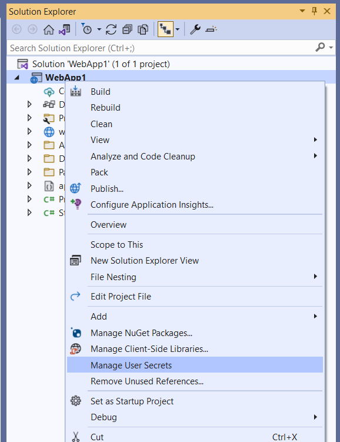

This is the first of a series of posts I will write about a topic I care a lot: secrets management.  

## What is a secret
First I want to clarify and give a definition about **what is a secret**. In software development, a secret is confidential information that is used to access protected resources. There are a lot of examples we can do: database connection strings, credentials such as username/password or app id/app secret, certificates with private key, personal access tokens. Because secrets are used to access protected resources, we need to carefully manage them in order to reduce the surface attack area.

## The problem
In the last years we have seen a big code repositories spread using platform such as GitHub, and most of them are available in a public way, without any kind of authentication. This is obvious because we are talking mostly about open source projects, so sharing the code in a public way is part of the game. The point is that one of the most common and **wrong** place where secrets are defined are configuration files. Why? Because it is simple and easy and, to be honest, is also a pattern that you usually find inside a lot of online examples, tutorials, hello world samples.
Unfortunately the dark web is full of credentials acquired by web crawlers that retrieve them from configuration files stored in publicly accessible git repositories.
So, the main goal of this series of posts is to find alternatives to configuration files pushed on your code repository where you can safely store secrets

## User Secrets
The first alternative place where you can store secrets is called **User Secrets**. This approach is strictly coupled with the .NET configuration system and we have the possibility to use it both in .NET and .NET Framework projects. 

## User Secrets in .NET
User Secrets in .NET (.NET Core, .NET 5, 6, 7 and so on) consists in using a new file called **secrets.json** located in the folder **%APPDATA%\Microsoft\UserSecrets\<user_secrets_id>\secrets.json**. 

The <user_secrets_id> is a GUID randomly generated when the user secrets are initialized for a project and when it occurs, the GUID is stored in the project file as follows: 
```
<PropertyGroup>
  <TargetFramework>netcoreapp3.1</TargetFramework>
  <UserSecretsId>79a3ecc0-2092-40a2-a04d-dcb46d6ca9ed</UserSecretsId>
</PropertyGroup>
```

We have three different ways to initialize it: using dotnet CLI, Visual Studio or Visual Studio Code.

### Dotnet CLI
With dotnet CLI we have to run the following command in the project directory:
```
dotnet user-secrets init
```
Then we have different dotnet CLI commands we can use to manipulate secrets:
- dotnet user-secrets list - to list all secrets
- dotnet user-secrets set <key> <value> - to add/update a secret value
- dotnet user-secrets remove <key> - to remove a secret
- dotnet user-secrets clear - to remove all secrets for the project

### Visual Studio
Visual Studio supports natively user secrets since at least Visual Studio 2015, but I recommend at least the version 2019 (16.4.4) to have the support in all type of .NET projects (web, console, and so on). It is very easy to set up and initialize user secrets with Visual Studio. Basically you have only to right-click on a project of your solution and select **Manage User Secrets**. 



If user secrets are already not initialized for the selected project, Visual Studio will automatically update the project file to add a new <user_secrets_id> and will create a new empty **secrets.json** file. Then the **secrets.json** file is ready to be edited.

### Visual Studio Code
Visual Studio Code doesn't support natively user secrets, but you can easily find an extension that will enable the same right-click Visual Studio experience. One example is [.NET Core User Secrets](https://marketplace.visualstudio.com/items?itemName=adrianwilczynski.user-secrets).

### Load User Secrets into .NET configuration 
Ok, now we have secrets.json populated, but how is used it inside the .NET configuration system? Well, we can think at the secrets.json file as a JSON file that will be loaded and merged along with appsettings.json file. So this means that we can structure the secrets.json file in the same way we use the appsettings.json and, when the Host builder will load the configuration at runtime we will find in the Configuration bag all the settings that we expect.

The good news is that the Host builder default configuration automatically adds the User Secrets configuration provider when it runs in Development environment (that means having **ASPNETCORE_ENVIRONMENT** for web projects or **DOTNET_ENVIRONMENT** for console/other projects set to **Development**: this is the standard configuration of Debug launch settings for many .NET project templates).

Considering a secrets.json file with the following content:
```
{
  "Movies": {
    "ServiceApiKey": "my secret"
  }
}
```

For ASP.NET projects the support is embedded in the usual WebApplication.CreateBuilder method. Example:
```
var builder = WebApplication.CreateBuilder(args);
var movieApiKey = builder.Configuration["Movies:ServiceApiKey"];
var app = builder.Build();
app.MapGet("/", () => movieApiKey);
app.Run();
```

For .NET projects we can use the Host.CreateDefaultBuilder method as follows:
```
using Microsoft.Extensions.Hosting;
using IHost host = Host.CreateDefaultBuilder(args).Build();
IConfiguration config = host.Services.GetRequiredService<IConfiguration>();
var movieApiKey = config["Movies:ServiceApiKey"];
Console.WriteLine($"{movieApiKey}");
```

## User Secrets in .NET Framework
In the last years all .NET developers have shifted their focus on the new .NET Core / .NET ecosystem and many people think that .NET Framework has been basically deprecated. Well, even though I strongly recommend using the last .NET version if you start a new project, there are situations where you have to do bug fix or implement new features in some .NET Framework based project. And also .NET Framework projects have the same secret's management issue because configuration files are text files (XML) that are commonly pushed on code repositories and potentially shared with a huge audience.

A lot of people don't know that starting from the 4.7.1 version, the .NET Framework configuration system has been enriched in order to support many configuration providers. This feature is called **[Configuration Builders](https://github.com/aspnet/MicrosoftConfigurationBuilders)**.

I don't want to go deep in detail in how the Configuration Builders API works. What is important to share in this article to achieve our goal is that we can add support to user secrets in ASP.NET projects based on .NET Framework adding a reference to the NuGet Package [Microsoft.Configuration.ConfigurationBuilders.UserSecrets](https://www.nuget.org/packages/Microsoft.Configuration.ConfigurationBuilders.UserSecrets/) and updating the web.config file as follows:
```
<Microsoft.Configuration.ConfigurationBuilders.SectionHandlers>
  <handlers>
    <add name="DefaultAppSettingsHandler" type="Microsoft.Configuration.ConfigurationBuilders.AppSettingsSectionHandler" />
    <add name="DefaultConnectionStringsHandler" type="Microsoft.Configuration.ConfigurationBuilders.ConnectionStringsSectionHandler" />
  </handlers>
</Microsoft.Configuration.ConfigurationBuilders.SectionHandlers
```
This first section adds the integration between the **appSettings** and **connectionStrings** sections and the configuration builders system.
```
<configBuilders>
  <builders>
    <add name="Secrets" userSecretsId="7863fe6f-c50a-47c4-a252-b748e91a822b" optional="true" type="Microsoft.Configuration.ConfigurationBuilders.UserSecretsConfigBuilder, Microsoft.Configuration.ConfigurationBuilders.UserSecrets, Version=2.0.0.0, Culture=neutral, PublicKeyToken=31bf3856ad364e35" />
  </builders>
</configBuilders>
```
This second section defines the configuration builders that we want to use. In this case we are adding only the user secrets support, and we specify the **userSecretsId** (can be a random GUID of our choice) and the **optional** flag to true (because we don't want the configuration system crashing if the secrets file is not created).
```
<appSettings configBuilders="Secrets">
</appSettings>
```
This last section links the user secrets builder to the **appSettings** section.

After you have updated the web.config file, Visual Studio will support user secrets editing also for .NET Framework web projects. Simply right-clicking to the project and selecting **Manage User Secrets** will open the **secrets.xml** file using the **userSecretsId** previously specified to define the file path. This XML file is structured as follows:
```
<?xml version="1.0" encoding="utf-8"?>
<root>
  <secrets ver="1.0">
    <secret name="secret name" value="secret value" />
    </secrets>
</root>
```

Ok, I admit that it may seem complicated, but in reality we are only doing two steps: adding a NuGet package to our project and updating the web.config file. You don't have to change anything in your code because the configuration builders system will automatically initialize the **System.Configuration.ConfigurationManager** static class (commonly used in .NET Framework projects) retrieving settings from both the standard web.config file and the additional **secrets.xml** file.

## Conclusion
In this first article of the series **Keep Your Secrets Secret**, we have seen together our we can move secrets from appsettings.json and web.config files to different files located on the developer machine, in a folder that will ensure that they will not be pushed on your code repository. 

The main advantages of this approach are that is quick and easy to implement (it requires zero code changes in most .NET projects) and is well-supported by Visual Studio. There are some disadvantages by the way: cannot be used in production, cannot be used for certificates (only for text-based secrets such as connection strings, passwords, client secrets) and requires that all developers in the team have a local copy of all secrets.