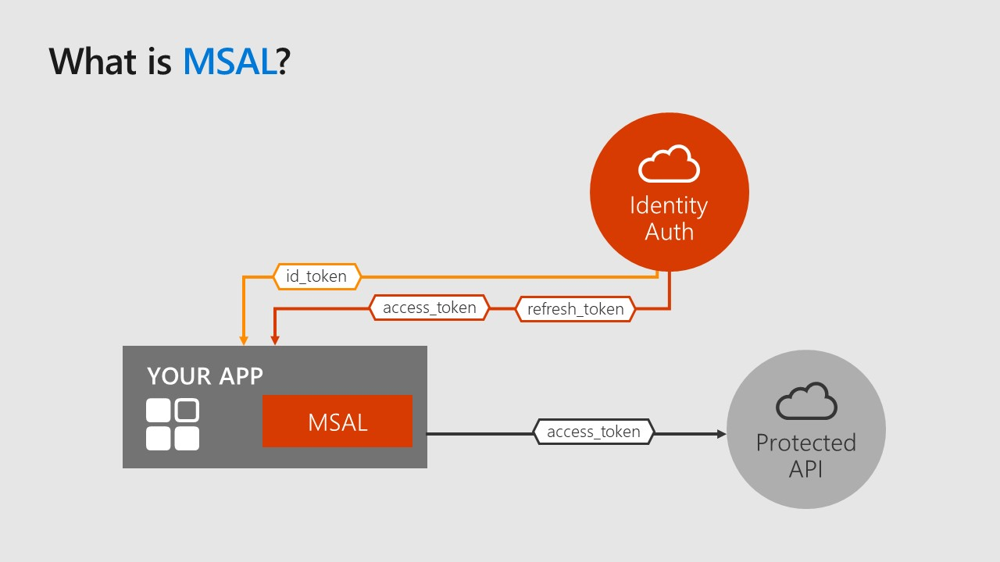
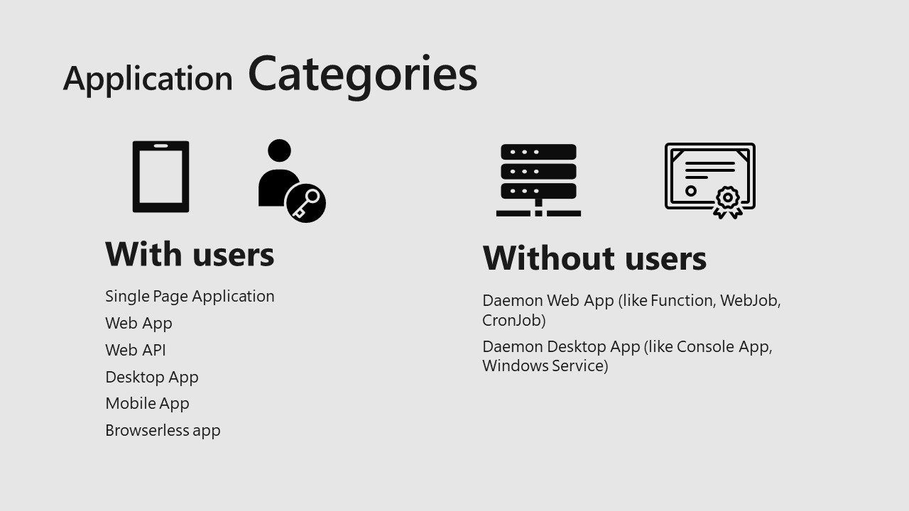
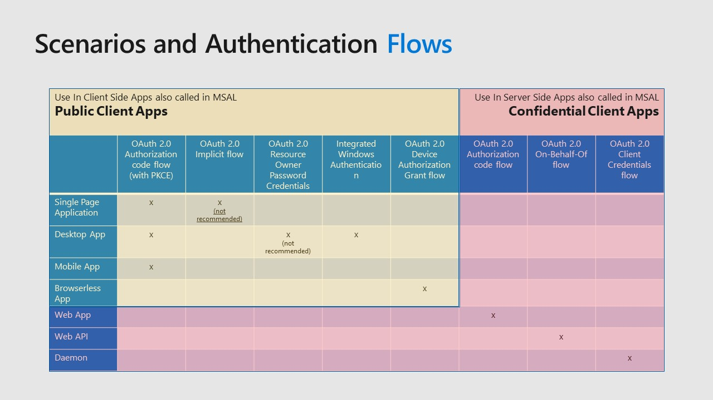
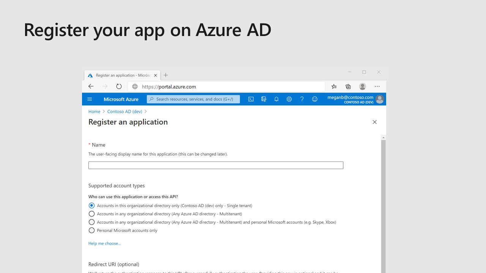
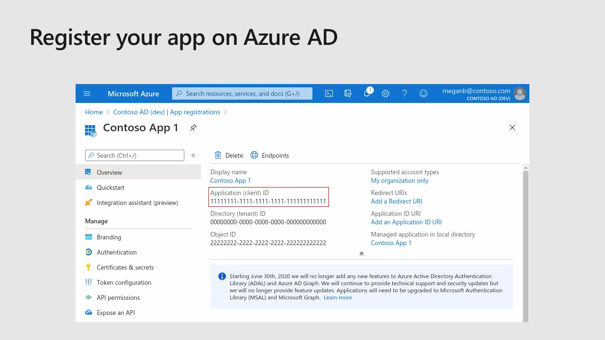

When we talk about authentication and authorization, it’s easy to get confused. In order to apply a good security approach, it’s very important to understand what is under the hood of a simple login screen with two textboxes asking for username and password. Applications must use different identity technologies in different situations and developers often don’t understand security and take short cuts.

When we develop a protected application that is not available in anonymous, we need a way to authenticate and often we need a way to call a protected resource, a protected API.

Inside this picture, MSAL plays an important role in our APP.

## What Is MSAL

The **Microsoft Authentication Library (MSAL)** enables developers to acquire tokens from the **Microsoft identity platform** in order to authenticate users and to access secured web APIs

Is a library used to acquire tokens and we can use these token to access protected resources like Microsoft Graph APIs, a third party API or also a custom API

Is very important to understand that we don’t use MSAL to secure our web applications or web api projects, but is used to access these API.

If we need a library that is part of Microsoft Identity Platform to protect our API, we have to use Microsoft Identity Web, that is a different library, a different package

We can use MSAL actually in all the most common platforms and frameworks. Obviously we support .NET, both the legacy and we can say old .NET Framework and new .NET Core/.NET 5 ecosystem. We support JavaScript, both server side with a specific node js package, and client side with a lot of different packages: plain JavaScript version can be used directly in our web pages, or if we develop a single page application, MSAL is available for React, Angular, and also for Blazor WebAssembly version. MSAL is available for Java (supporting mobile Android apps) and Python as well. And MSAL also provides a version for Objective C platforms like MacOS and iOS.

## Application Categories

In the use of MSAL, we can consider two main application categories. 
- **Applications With Users**, in which we have a user interface where the end-user interact and in this case we use MSAL to acquire a token for a user, to authenticate the user and give to the user access to protected resources. 
- On the other hand we have **Applications Without Users**. In this case we acquire a token as an application and we give to the application access to protected resources

On the first category we can find all kind of applications that provides a user interface: APIs called by these user interfaces, single page applications, web applications, mobile applications and also a desktop applications (yes, there are people that are still developing desktop applications :) nowadays). Browserless apps are also becoming common: for example apps that runs on a TV or that runs on a system that cannot provide a browser to authenticate the user.

On the second category, the without users category, we are talking basically about windows services, background jobs, web jobs, timer triggered functions, scheduled console applications, and so on. In this category we don’t have any user interaction, but the app needs to authenticate with an application context to call protected apis.

## Scenarios and Authentication Flows

Because MSAL is used to access a protected resource, regardless of the fact that the code runs client side or server side, MSAL consider all applications as client applications, but it divides them in two types: **public** client apps and **confidential** client apps.

MSAL supports a lot of different scenarios and authentication flows and in this slide you can find the recommended mapping between the supported authentication flows and the type of applications that should use it. Why I am talking about recommendation? Because authentication flows that are mapped on public client apps are designed to avoid that the application directly handles user credentials. The only exception is the **OAuth 2.0 Resource Owner Password Credentials flow** that I have marked as **NOT RECOMMENDED** because in this flow we need from the UI of our app to ask the user his/her credentials. Then we pass credentials as input to MSAL. So in this case we are directly handling sensitive informations and this should be avoided.

**OAuth 2.0 Authorization code flow** (with Proof Key for Code Exchange) is basically the most common flow used by all public client applications. You probably don't even notice it, but we use this flow every time we access a protected web application. What happens is that the app redirects to Azure AD that asks our credentials and Azure AD validates our credentials and redirect back to our application with an access token that the app can use to call protected resources/API.

Apart this flows, with MSAL we can use **Integrated Windows Authentication** and **Device Authorization Grant Flow** as well for browserless app.

Now let’s talk about the right side, the confidential client apps. In these cases we are talking about server side applications that uses MSAL to acquire a token server side and to do it, we use authentication flows that require a secret or a certificate.

Obviously we are talking about recommendations because no one can prevent me to put the confidential client apps code inside a public app and a lot of people that don’t really know the difference between them, do it. The consequence is a bad and not secure software design, with exposed secrets and credentials that can be used maliciously.

## How to use MSAL?

To use MSAL means following basically four steps:
- Register your Azure AD application
- Define authentication details
- Define permissions
- Code :wink:

### Register your Azure AD application

Just open [Azure Portal](https://portal.azure.com), look for Azure Active Directory and open it. In the AAD page, click on "App registrations" and then "New registration". Something simlar should appear on your screen

Fill the form with the app name and click Register. Then the overview page of your app should be like this

I don't want to go too deep in the details regarding app registrations because there are a lot of different settings that can be useful. For more details please take a look at the [official documentation](https://docs.microsoft.com/en-us/azure/active-directory/develop/quickstart-register-app). I will focus on two aspects: authentication details and permissions.

### Define authentication details

There is a strict relationship between the authentication configuration and the OAuth Flows that will be enabled by Azure AD for your app. However this complexity is hidden by the definition of the type of platform of you application. Choosing Web platform, the OAuth 2.0 Authorization code flow will be enabled, while choosing Single Page Application platform will enable the OAuth 2.0 Authorization code with PKCE flow.
In the Advanced settings, the flag Allow public client flows will enable the app to use Resource Owner Credential Flow, Device Code Flow and Windows Integrated Auth Flow. Because these flows are basically the most dangerous (especially the first where your code will handle sensitive info), don't enable this flag if is not required by your application use cases.

If your app is a Confidential Client Apps and you are gonna use the OAuth 2.0 Client Credentials Flow or the OAuth 2.0 On Behalf-Of Flow, then you will need to define a certificate or a secret.

### Define permissions

As last step, if your app needs to access a protected resources like Microsoft Graph API or another protected API (that has been registered in Azure AD), you have to declare it in the page **API permissions**. 
You will be able to select two types of permissions: **delegated** and **application**. The choice is closely related to the authentication model of your app. If you app uses an user context (this means that in some point in time in the authentication flow a user will sign in), then you will use delegated permissions. On the other hand, if your app is a background application without any user interaction, then it will use application permissions.
Remember that delegated permissions, because are related to the user context, defines what your app can do acting as a user. However if the user authenticated doesn't have that specific permission, your app will get an unauthorized exception. The effective permissions usable by your application are an intersection between the delegated permissions defined in the app registration and the authenticated user permissions.
This behavior doesn't apply to application permissions because in this case the application authenticates using its credentials (secret or certificate), so the effective permissions will be all the application permissions defined in the app registration. For this reason usually in order to add an application permission to an app registrations, the Tenant Administrator consent is required (you can see in the screenshot the "Grant admin consent for Contoso" button).

[Azure Static Web Apps](https://docs.microsoft.com/en-us/azure/static-web-apps/overview)