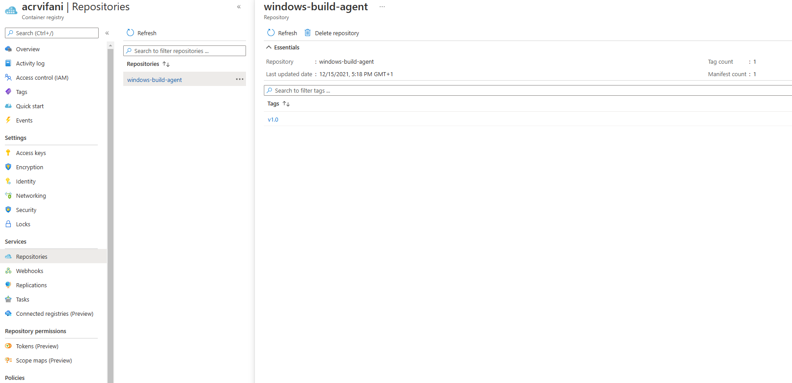
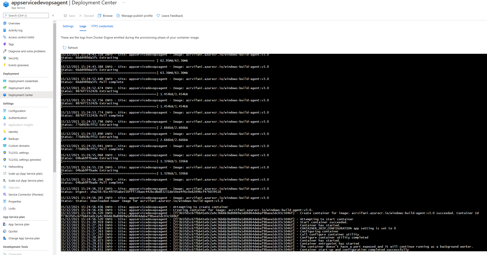

In the previous [post](https://www.vifani.com/how-to-create-an-azure-devops-windows-self-hosted-build-agent-docker-image) we have seen how to create a container image with an Azure Self Hosted Agent based on a Windows container. Then we have run this container on a local Docker installation.
This is not very useful because usually we need the agent continuously running somewhere.
In Azure, we have multiple ways to host a container: Azure Kubernetes Service, Azure Container Instance or Web App for Containers. In this article I will talk about how to run the DevOps Agent on the last one.

## Build a Docker Image on Azure Container Registry
The minimal resource set that we need are: a **Container Registry**, an **Azure App Service Plan** supporting containers and a **Web App for Containers** instance.

We can consider Azure Container Registry as a managed container service that can be used to build and index our images. To build our Azure DevOps Agent container image the steps are the following:
- Install Azure CLI (https://docs.microsoft.com/en-us/cli/azure/install-azure-cli)
- Clone the repository
```
git clone https://github.com/vifani/devops-hosted-agent.git
```
- Login to Azure
```
az login
```
- Create a Resource Group and an Azure Container Registry instance
```
az group create --name devopsagent --location westeurope
az acr create --resource-group devopsagent --name acrvifani --sku Basic --admin-enabled true
```
- Build the image
```
az acr build --registry acrvifani -t windows-build-agent:v1.0 --platform windows .
```
The last command creates a package starting from the current folder, uploads it to Azure Container Registry and executes the Dockerfile to build the image. The resulting image is tagged as **windows-build-agent:v1.0**



If the command has been correctly executed, you will see the image showing up in the Azure Container Image repositories

## Run a Docker Image on Azure Web App for Containers
Now is time to run the container image on an Azure Web App for Containers instance.
Considering that in the previous chapter we have already set up an Azure Container Registry, the steps to prepare the remaining resources are the following:
```
az appservice plan create -g devopsagent -n appservplandevopsagent --hyper-v --sku P1V3
az webapp create -g devopsagent -p appservplandevopsagent -n appservicedevopsagent -i acrvifani.azurecr.io/windows-build-agent:v1.0 --docker-registry-server-user <<some user name>> --docker-registry-server-password <<some password>>
```

Because we are running an Azure DevOps Agent on Windows, we have to use at least the P1V3 SKU, the minimal supporting Hyper-V (you can see the --hyper-v flag in the CLI command).

The last step is about configuring our DevOps Agent. We need to put into the App Service Settings the same parameters we have used to run the Docker Image locally on Windows:
- **AZP_URL**: for example "https://dev.azure.com/yourorganization"
- **AZP_TOKEN**: a valid Personal Access Token (more details [here](https://docs.microsoft.com/en-us/azure/devops/organizations/accounts/use-personal-access-tokens-to-authenticate?view=azure-devops&tabs=preview-page))
- **AZP_POOL**: the Azure DevOps Agent Pool name
- **AZP_AGENT_NAME**: the agent name

We can use the following command to define the settings:
```
az webapp config appsettings set -g devopsagent -n appservicedevopsagent --settings AZP_URL=<Azure DevOps instance> AZP_TOKEN=<PAT token> AZP_POOL=<Pool Name> AZP_AGENT_NAME=mydockeragent
```

By default, all Windows Containers deployed in Azure App Service are limited to 1 GB RAM. If you need more memory, you can change this value by providing the **WEBSITE_MEMORY_LIMIT_MB** app setting
```
az webapp config appsettings set -g devopsagent -n appservicedevopsagent --settings WEBSITE_MEMORY_LIMIT_MB=1536
```




If everything goes well, in the Deployment Center panel of the new Web App For Containers instance you will see "Container start-up and configuration completed successfully" sentence.